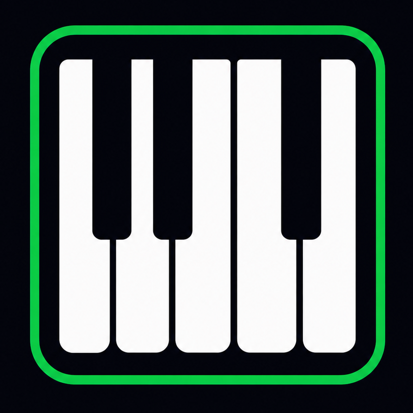

<p align="center">
  
</p>

<h1 align="center">Interactive Piano</h1>

<p align="center">
  A browser-based piano with recording, playback, and multi-touch support — built with React and the Web Audio API.
  <br /><br />
  <a href="#features"></a>
  <a href="#features"></a>
  <a href="#features"></a>
  <a href="https://github.com/Silaenn/EatNSplit"></a>
</p>

---

## Table of Contents

- [About](#about)
- [Features](#features)
- [Tech Stack](#tech-stack)
- [Getting Started](#getting-started)
- [Usage](#usage)
- [Project Structure](#project-structure)
- [Deployment](#deployment)
- [Author](#author)

---

## About

Interactive Piano is a real-time polyphonic piano that runs entirely in the browser. It supports mouse, touch, and computer keyboard input, and includes a built-in recording system that captures both note-on and note-off events with precise timing for faithful playback of chords and articulation.

The project was built as a lightweight, zero-dependency music tool — no plugins, no downloads, just open and play.

---

## Features

- **Polyphonic engine** — Unlimited simultaneous notes via dedicated oscillator + gain envelope per key
- **Multi-input** — Mouse click/drag, multi-touch (tracked per finger), and QWERTY keyboard mapping
- **Recording & playback** — Captures note-on and note-off timing; plays back with original articulation and chord fidelity
- **Octave shifting** — Shift the full keyboard up or down across 6 octaves
- **Glassmorphism UI** — Dark emerald theme with noise texture, blurred surfaces, and responsive layout
- **Landscape-aware** — Rotate-to-landscape prompt on narrow screens; optimized piano height in landscape
- **Touch-optimized** — Per-finger tracking using `touch.identifier` for accurate multi-touch slides

---

## Tech Stack

| Layer | Technology |
|-------|-----------|
| **Framework** | [React 19](https://react.dev) |
| **Audio** | [Web Audio API](https://developer.mozilla.org/en-US/docs/Web/API/Web_Audio_API) (OscillatorNode + GainNode) |
| **Styling** | Pure CSS (glassmorphism, noise texture, custom animations) |
| **Icons** | [Phosphor Icons](https://phosphoricons.com) |
| **Typography** | Poppins + Righteous (Google Fonts) |
| **Build** | Create React App 5 |

<p>
  
  
  
  
</p>

---

## Screenshots

```
[Screenshot 1] — Piano view with active notes and recording status bar
[Screenshot 2] — Recording playback in progress
[Screenshot 3] — Landscape orientation on mobile
```

---

## Getting Started

### Prerequisites

- Node.js >= 16
- npm >= 8

### Installation

```bash
git clone https://github.com/Silaenn/EatNSplit.git
cd interactive-piano
npm install
```

No API keys, environment variables, or external services are required.

---

## Usage

```bash
npm start
```

Opens at [http://localhost:3000](http://localhost:3000).

### Controls

| Input | Action |
|-------|--------|
| **Mouse click** on a key | Play note |
| **Drag** across keys | Glissando |
| **A W S E D F T G Y H U J K** | White and black keys (see on-screen legend) |
| **Shift** + key | +1 octave |
| **← / →** | Shift octave down / up |
| **Multi-touch** | Play chords with multiple fingers |

### Recording

1. Press **Record** — all played notes are captured with timing
2. Press **Stop Rec** to end the recording
3. Press **Play** to hear the recording with original timing and articulation
4. **Clear** to delete the recorded take

---

## Project Structure

```
interactive-piano/
├── public/
│   ├── index.html          # HTML template + Google Fonts
│   ├── logo.png            # App logo / favicon
│   ├── manifest.json       # PWA manifest
│   └── robots.txt
├── src/
│   ├── components/
│   │   ├── Piano.js        # Keyboard UI + mouse/touch event wiring
│   │   ├── Controls.js     # Record/Play/Stop/Clear + octave buttons
│   │   ├── StatusBar.js    # Octave, active notes, recording status
│   │   └── RotateOverlay.js# Landscape-orientation prompt
│   ├── hooks/
│   │   └── usePiano.js     # Central state, audio engine, recording/playback logic
│   ├── constants/
│   │   └── notes.js        # Note definitions, frequencies, keyboard map
│   ├── App.js              # Root composition
│   ├── index.js            # Entry point
│   └── index.css           # All styles
└── package.json
```

---

## Deployment

The app is a static React SPA and can be deployed to any static host.

### Vercel

```bash
npx vercel --prod
```

### GitHub Pages

```bash
npm run build
npx gh-pages -d build
```

The `build/` folder after `npm run build` contains the entire deployable application.

---

## Author

Built by [Silaenn](https://github.com/Silaenn).

Project Link: [https://github.com/Silaenn/EatNSplit](https://github.com/Silaenn/EatNSplit)
